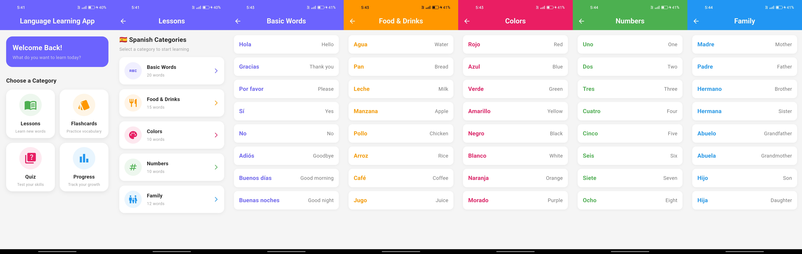
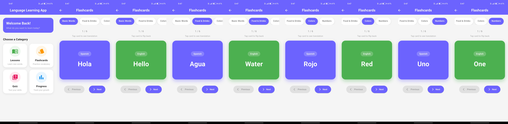
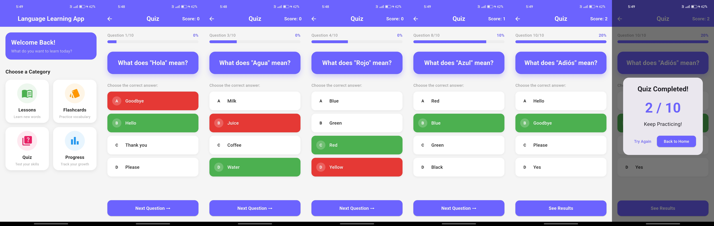
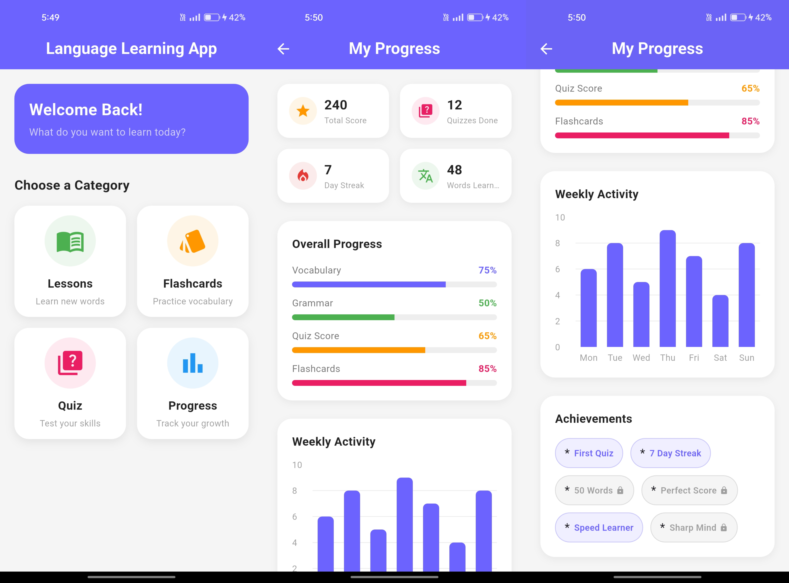

# Language Learning App - Flutter

Built this as part of the **CodeAlpha App Development Internship (Task 4)**. The goal was to create an interactive language learning app with vocabulary lessons, flashcard practice, quizzes, and progress tracking.

---

## What this app does

A mobile app for learning Spanish vocabulary across four core sections:

**Lessons** - browse Spanish vocabulary organized by categories. Each category opens a word list showing the Spanish word and its English translation side by side. Categories include Basic Words, Food & Drinks, Colors, Numbers, and Family.

**Flashcards** - practice vocabulary with interactive flip cards. Select a category from the horizontal chip selector, tap the card to flip it and reveal the English translation, navigate between cards using Previous and Next buttons.

**Quiz** - test your knowledge with 10 MCQ questions. Each question shows a Spanish word with 4 options. Correct answers highlight green, wrong answers highlight red instantly. Score is tracked live in the app bar and a result dialog shows at the end with performance feedback.

**Progress** - track your learning journey with a dashboard showing total score, quizzes done, day streak, and words learned. Includes category-wise progress bars, a weekly activity bar chart, and achievement badges with locked/unlocked states.

---

## Architecture

Kept it simple with a **Screen-based architecture** suitable for the scope of this project:

- Each screen is self-contained with its own state
- Navigation handled via `Navigator.push` with `MaterialPageRoute`
- No prop drilling — each screen manages its own data locally
- Stateful widgets used only where interaction is needed (Flashcards, Quiz)
- Stateless widgets used for read-only screens (Lessons, Progress)

---

## Screens built

- **HomeScreen** - landing screen with a welcome banner and 4 navigation cards in a grid layout
- **LessonScreen** - category list with colored icons, tapping opens WordListScreen for that category
- **WordListScreen** - flat list of Spanish/English word pairs with color-coded text per category
- **FlashcardScreen** - animated flip card with category selector, card counter, and navigation buttons
- **QuizScreen** - MCQ quiz with progress bar, animated option highlighting, score tracking, and result dialog
- **ProgressScreen** - dashboard with stat cards, linear progress indicators, fl_chart bar chart, and achievement badges

---

## Screenshots

### Home Screen
The landing screen with a welcome banner and four navigation cards for Lessons, Flashcards, Quiz and Progress.

---

### Lessons Screen
Browse Spanish vocabulary by category. Each category opens a word list showing Spanish words and their English translations side by side. Includes Basic Words, Food & Drinks, Colors, Numbers and Family.

---

### Flashcard Screen
Practice vocabulary with interactive flip cards. Tap the card to flip between Spanish and English. Navigate between cards using Previous and Next buttons. Switch categories using the chip selector at the top.

---

### Quiz Screen
Test your knowledge with 10 MCQ questions. Correct answers highlight green and wrong answers highlight red instantly. Score is tracked live and a result dialog appears at the end.

---

### Progress Screen
Track your learning with a dashboard showing total score, quizzes done, day streak and words learned. Includes category-wise progress bars, a weekly activity bar chart and achievement badges.

---

## Stack

- Flutter 3.41.7 (stable)
- Dart 3.11.5
- fl_chart 0.66.2 — weekly activity bar chart
- flip_card 0.7.0 — installed but replaced with custom AnimationController flip
- No backend, all data hardcoded per screen

---

## Notes

- Portrait mode only, optimized for mobile
- No API calls, all vocabulary data is hardcoded in each screen
- Custom flip animation built using `AnimationController` and `Matrix4.rotateY` instead of the flip_card package for better reliability
- `withValues(alpha:)` used throughout instead of deprecated `withOpacity()`
- Overflow fix applied to stat cards using `Expanded` wrapper around text columns

---

## Internship

Built as part of the **CodeAlpha App Development Internship**
- Company: [CodeAlpha](https://www.codealpha.tech)
- Task 4: Language Learning App

---

## Developer

**Aditya**
- GitHub: [@comradeaditya](https://github.com/comradeaditya)